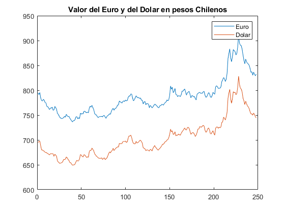

# Indicadores enconomicos

[](https://la.mathworks.com/matlabcentral/fileexchange/75497-indicadores-enconomicos)

Este es un cliente de la API que entrega los principales indicadores económicos para Chile en formato Table o struct. Tanto los indicadores diarios como los históricos pueden ser usados por desarrolladores y/ analistas en aplicaciones, analisis, etc.

La API mapea constantemente el sitio del Banco Central de Chile manteniendo así la base de datos actualizada con los últimos valores del día.

La documentación oficial de la API puede ser encontrada en el siguiente sitio web https://mindicador.cl/

La documentación del cliente en Matlab puede ser encontrada en el siguiente sitio https://la.mathworks.com/matlabcentral/fileexchange/75497-indicadores-enconomicos

Si es que el toolbox esta instalado en su version de Matlab, puede solicitar la documentacion completa del cliente ocupando el siguiente comando

```
% Extraccion de los Indicadores disponibles a solicitar desde la API,
% como su rango de tiempo disponible.
doc(Indicadores)
```

## Introduccion
Este documento va a explicar la funcionalidad que posee el cliente de la API Indicadores económicos, en donde se incluirá la inicialización de la clase, los métodos que posee para solicitar datos desde la API y posibles ideas de su uso futuro.

Para inicializar el objeto Indicadores, se debe invocar la clase y almacenarla en alguna variable. Tenga en cuenta que la API no solicita un llave o apikey para su uso, por ende, la clase se puede inicializar de forma vacía o ingresando el tiempo máximo de espera para el cliente Matlab. A continuación se muestra un caso de uso de lo anteriormente explicado.

## Inicializacion
```
% Inicializando la clase sin ninguna propiedad, de manera
% predeterminada el cliente tiene un tiempo de espera maximo de 60
% segundos
rest_client = Indicadores();

% Alternativamente se puede definir de la siguiente manera
rest_client = Indicadores(45); % 45 segundos de espera maxima.

% Desplegar las propiedades de la clase
rest_client.options
```

## Metodos Disponibles

Los siguientes metodos, poseen la capacidad de explotar el maximo potencial de datos que ofrece la API.

1. ```metadata()```

Este método extrae los endpoints disponibles para cliente de la API, no necesita ningún tipo de parámetros, ya que descarga la información desde la pagina web de la API.

- Argumentos Name-value

Ninguno

- Resultados

String array con los endpoints/indicadores disponibles para solicitar desde la API.

- Ejemplo(s)

```
% Solicitar los indicadores disponibles para la api
rest_client.metadata()
```

2. ```get_data()```

Este método crea la solicitud a la API con respecto a los datos del indicador referenciado. Actualmente la API es capaz de enviar datos bajo las siguientes modalidades:Un 'snapshot' al día de hoy de todos los indicadores disponibles; Valores para los ultimos 30 dias para algún indicador; Solicitar datos para algún indicador especifico, para alguna fecha específica (o año especifico).

- Argumentos Name-value

	- ```indicador(char)```: Indicador económico a solicitar. Para una lista completa de los indicadores disponibles ocupe el método metadata o get_data().

	- ```fecha(char)```: Fecha para solicitar datos, esta puede tener los siguientes formatos: 'yyyy' o 'dd-MM-yyyy'

	- ```table_format(logical)```: Los valores de la solicitud a la API true es el valor predeterminado.

- Resultado(s)

Tabla o struct con los datos solicitados

- Ejemplos

```
% Snapshot con todos los indicadores disponibles con los datos más recientes
rest_client.get_data()
% valor de la UF en los últimos 30 días.
rest_client.get_data('indicador', 'uf')
% valores del Indice de valor promedio para el día 24 de Octubre de 1991
rest_client.get_data('indicador', 'ivp', 'fecha', '24-10-1991')
% ver un resumen de la solicitud anterior
summary(ans)
```

## Caso de uso practico
A continuación se presenta un caso de uso en donde expone el potencial del ciente en Matlab para la API Indicadores economicos. Dicho eso, se solicitara datos sobre el euro y el dolar a la API, para luego graficar su comportamiento contra el peso chileno durante año 2019.

```
  clear;clc;
  % Inicializando la clase
  rest_client = Indicadores();

  % Solicitando los datos para cada dia a la API
  euro = rest_client.get_data('indicador', 'euro', 'fecha', '2019');
  dolar = rest_client.get_data('indicador', 'dolar', 'fecha', '2019');

  % Graficando su comportamiento
  plot(euro.valor)
  hold on
  plot(dolar.valor)
  legend('Euro', 'Dolar')
  title('Valor del Euro y del Dolar en pesos Chilenos')
```

 


```
 sprintf('Ambos precios poseen una correlacion de %.2f', corr(euro.valor, dolar.valor))

  ans =

    'Ambos precios poseen una correlacion de 0.98'
```